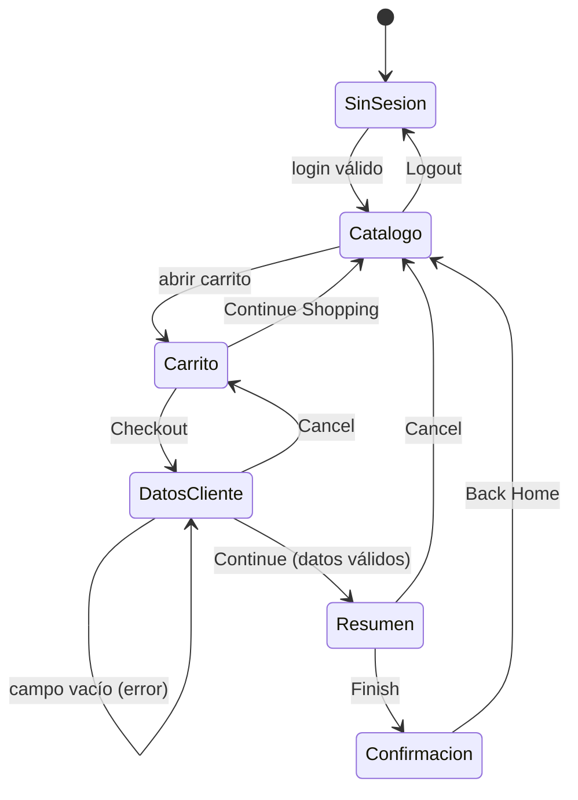

# 🧠 Técnicas de Diseño de Pruebas

Aplicación práctica de técnicas de caja negra (programa ISTQB Foundation Level) sobre SauceDemo.
Cada técnica termina en **casos de prueba concretos** que aparecen en la
[matriz de casos](casos-de-prueba/matriz-casos-de-prueba.csv).

---

## 1. Partición de equivalencia

La idea: dividir las entradas en grupos que el sistema debería tratar igual y probar **un representante de cada grupo**.

### Campo "Username" del login

| Partición | Tipo | Valor representante | Resultado esperado | Caso |
|---|---|---|---|---|
| Usuario válido y activo | Válida | `standard_user` | Accede al catálogo | LOGIN-01 |
| Usuario válido pero bloqueado | Inválida | `locked_out_user` | "Sorry, this user has been locked out." | LOGIN-03 |
| Usuario inexistente | Inválida | `usuario_que_no_existe` | "Username and password do not match…" | LOGIN-07 |
| Vacío | Inválida | `""` | "Username is required" | LOGIN-05 |

### Formulario de checkout (paso 1)

| Campo | Partición válida | Partición inválida | Casos |
|---|---|---|---|
| First Name | Texto no vacío | Vacío | CHK-01 / CHK-04 |
| Last Name | Texto no vacío | Vacío | CHK-01 / CHK-05 |
| Postal Code | Texto no vacío | Vacío | CHK-01 / CHK-06 |

> 💡 **Observación de QA:** el código postal acepta cualquier texto (letras, símbolos). Si el negocio requiere
> validar el formato, se debería levantar como **mejora** (no como defecto, porque no hay un requisito que lo exija).

---

## 2. Análisis de valores límite

Se prueban los **bordes** de un rango, donde suelen esconderse los errores ("off-by-one").

### Cantidad de productos en el carrito (rango válido: 0 a 6)

| Valor | Por qué | Resultado esperado | Caso |
|---|---|---|---|
| 0 | Límite inferior | Contador oculto | CART-04 |
| 1 | Justo sobre el límite inferior | Contador muestra "1" | CART-01 |
| 5 | Justo bajo el límite superior | Contador muestra "5" | CART-07 (manual) |
| 6 | Límite superior (todos los productos) | Contador muestra "6" y todos los botones dicen "Remove" | CART-08 (manual) |

---

## 3. Tabla de decisión: login

Combina condiciones para cubrir todas las reglas del login.

| Condición / Regla | R1 | R2 | R3 | R4 | R5 |
|---|---|---|---|---|---|
| ¿Usuario ingresado? | No | Sí | Sí | Sí | Sí |
| ¿Contraseña ingresada? | – | No | Sí | Sí | Sí |
| ¿Credenciales correctas? | – | – | No | Sí | Sí |
| ¿Usuario bloqueado? | – | – | – | Sí | No |
| **Acción esperada** | Error "Username is required" | Error "Password is required" | Error "do not match" | Error "locked out" | **Acceso al catálogo** |
| **Caso** | LOGIN-05 | LOGIN-06 | LOGIN-04 | LOGIN-03 | LOGIN-01 |

`–` = no importa (la regla ya se decidió antes).

---

## 4. Transición de estados: flujo de compra

| Transición probada | Caso |
|---|---|
| SinSesion → Catalogo | LOGIN-01 |
| Catalogo → SinSesion (y bloqueo de acceso directo) | LOGIN-02 |
| Carrito → Catalogo (Continue Shopping) | CART-06 |
| DatosCliente → DatosCliente (error) | CHK-04, CHK-05, CHK-06 |
| Resumen → Catalogo (Cancel) | CHK-03 |
| Resumen → Confirmacion | CHK-01 |

---

## 5. Pruebas basadas en la experiencia

### Error guessing (errores probables)

| Idea | Resultado | Referencia |
|---|---|---|
| ¿Cada producto muestra su propia imagen? | ❌ Falla con `problem_user` | [BUG-01](bugs/BUG-01-imagenes-duplicadas.md) |
| ¿Cada campo del formulario guarda lo que escribo en él? | ❌ Falla con `problem_user` | [BUG-02](bugs/BUG-02-apellido-no-editable.md) |
| ¿El carrito sobrevive a un F5? | ✅ Pasa | CART-05 |
| ¿Puedo entrar a /inventory.html sin sesión? | ✅ Bloqueado correctamente | LOGIN-02 |

### Charter de sesión exploratoria (ejemplo)

| Campo | Detalle |
|---|---|
| **Misión** | Explorar el checkout con distintos usuarios de prueba para descubrir comportamientos inconsistentes |
| **Duración** | 30 minutos |
| **Datos** | `problem_user`, `error_user`, `performance_glitch_user` |
| **Hallazgos** | BUG-02: en *Last Name*, cada tecla reemplaza el valor de *First Name* (hallado de forma manual). |
