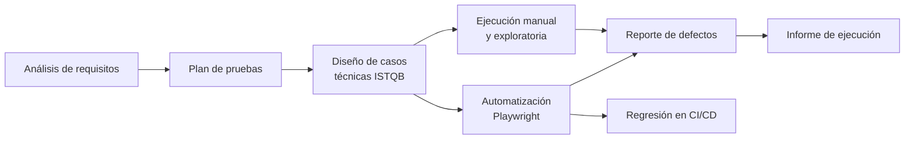

# 📋 QA Test Design · SauceDemo

Documentación completa del **proceso de QA manual y funcional** para la tienda online
[SauceDemo](https://www.saucedemo.com): desde el plan de pruebas y el diseño de casos con técnicas ISTQB,
hasta los reportes de defectos y el informe de ejecución.

Es la base del proyecto de automatización
**[playwright-e2e-saucedemo](https://github.com/yaquelin2305/playwright-e2e-saucedemo)**: cada caso automatizado
tiene aquí su diseño, su requisito y su trazabilidad.

> 🇬🇧 *Complete QA documentation for SauceDemo: test plan (ISO 29119-based), user stories with Gherkin acceptance criteria,
> ISTQB test design techniques, a Jira/Xray-importable test case matrix, traceability matrix, bug reports and a test execution report.*

---

## 🗺️ Contenido

| # | Documento | Qué muestra |
|---|---|---|
| 1 | [Plan de pruebas](01-plan-de-pruebas.md) | Alcance, estrategia, ambiente, criterios de entrada/salida, riesgos y clasificación de defectos |
| 2 | [Requisitos](02-requisitos.md) | 8 historias de usuario con criterios de aceptación en Gherkin |
| 3 | [Técnicas de diseño](03-tecnicas-de-diseno.md) | Partición de equivalencia, valores límite, tabla de decisión, transición de estados y *error guessing* |
| 4 | [Matriz de casos de prueba (CSV)](casos-de-prueba/matriz-casos-de-prueba.csv) | 30 casos con precondiciones, pasos y resultado esperado; importable en Jira + Xray |
| 5 | [Matriz de trazabilidad](casos-de-prueba/matriz-trazabilidad.md) | Requisito → casos → automatización → defectos |
| 6 | [Reportes de bugs](bugs/) | [BUG-01](bugs/BUG-01-imagenes-duplicadas.md) (Media) · [BUG-02](bugs/BUG-02-apellido-no-editable.md) (Alta, bloquea la compra) |
| 7 | [Informe de ejecución](04-informe-de-ejecucion.md) | Resultados, métricas, criterios de salida y lecciones aprendidas |
| 8 | [Plantillas](plantillas/) | Plantillas reutilizables de caso de prueba y reporte de bug |

## 📈 Resultados en cifras

| | |
|---|---|
| Requisitos cubiertos | **8 / 8 (100 %)** |
| Casos de prueba | **30** (8 Alta · 18 Media · 4 Baja) |
| Automatizados | **28 (93 %)** en 4 navegadores |
| Defectos encontrados | **2** (1 Alta, 1 Media) |
| Criterios de salida | ✅ Cumplidos para `standard_user` |

## 🔄 Proceso seguido

## 🛠️ Herramientas y estándares

ISTQB Foundation Level (técnicas y glosario) · ISO/IEC/IEEE 29119-3 (estructura del plan) · Gherkin/BDD ·
formato de importación de Jira + Xray · Playwright · GitHub Actions

---

👩‍💻 **Yaquelin Rugel Alvarado**, QA Analyst Jr ·
[LinkedIn](https://linkedin.com/in/yaquelin-rugel) · [GitHub](https://github.com/yaquelin2305)
