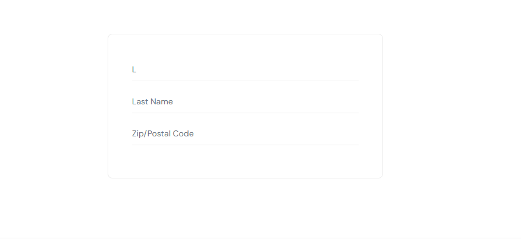

# 🐞 BUG-02 · En el checkout, el apellido se escribe en el campo "First Name" y la compra queda bloqueada

| Campo | Detalle |
|---|---|
| **ID** | BUG-02 |
| **Estado** | Abierto |
| **Severidad** | **Alta** |
| **Prioridad** | P1 |
| **Módulo** | Checkout · Paso 1 (datos del cliente) |
| **Requisito afectado** | REQ-06 · Datos del cliente |
| **Caso que lo detecta** | CHK-01 (manual con `problem_user`) · BUG-02 en la suite automatizada |
| **Ambiente** | https://www.saucedemo.com · Chrome, Firefox, Safari (WebKit) · Windows / Ubuntu (CI) |
| **Usuario de prueba** | `problem_user` |
| **Reportado por** | Yaquelin Rugel · Septiembre 2026 |
| **Reproducibilidad** | 100 % (siempre) |

## Resumen
Con `problem_user`, lo que se escribe en el campo **Last Name** no queda en ese campo: **cada tecla reemplaza el valor de
First Name**. Al escribir el apellido letra por letra, *First Name* termina mostrando una sola letra y *Last Name* queda vacío,
por lo que **el cliente no puede terminar la compra**.

## Pasos para reproducir
1. Ir a https://www.saucedemo.com e iniciar sesión con `problem_user` / `secret_sauce`
2. Agregar **Sauce Labs Backpack** al carrito
3. Abrir el carrito y hacer clic en **Checkout**
4. Hacer clic en el campo **Last Name** y escribir `Rugel` con el teclado
5. Observar los campos **First Name** y **Last Name**

## Resultado esperado
El campo **Last Name** muestra `Rugel` y **First Name** no cambia.

## Resultado obtenido
- **Last Name** queda vacío (solo muestra el texto de ayuda "Last Name").
- **First Name** muestra **una sola letra**: cada tecla reemplaza el contenido anterior en lugar de agregarse.
- Si el texto se pega o se ingresa de una sola vez (como en la prueba automatizada), *First Name* muestra `Rugel` completo.
- Como *Last Name* nunca se llena, no es posible avanzar al resumen de compra.

## Evidencia
- Prueba automatizada que lo detecta: [`tests/known-bugs/problem-user.spec.ts`](https://github.com/yaquelin2305/playwright-e2e-saucedemo/blob/main/tests/known-bugs/problem-user.spec.ts) (BUG-02)
- Captura de pantalla:

## Impacto
**Bloquea la compra**: es el flujo de mayor valor para el negocio y no existe una alternativa para el usuario.
Por eso la severidad es **Alta** y se recomienda prioridad **P1**.

## Notas para desarrollo
- Probable causa: el manejador de cambios (`onChange`) del campo Last Name actualiza el estado de First Name con el último carácter del evento.
- Hallado en prueba manual y confirmado con la prueba automatizada: ambas formas de ingreso (tecla por tecla y valor completo) reproducen la falla.
- Con `standard_user` el formulario funciona correctamente (caso CHK-01 aprobado).